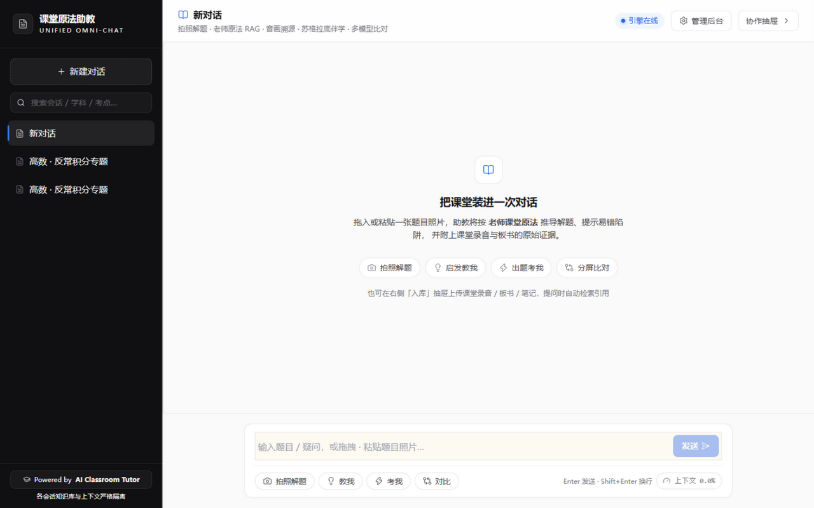
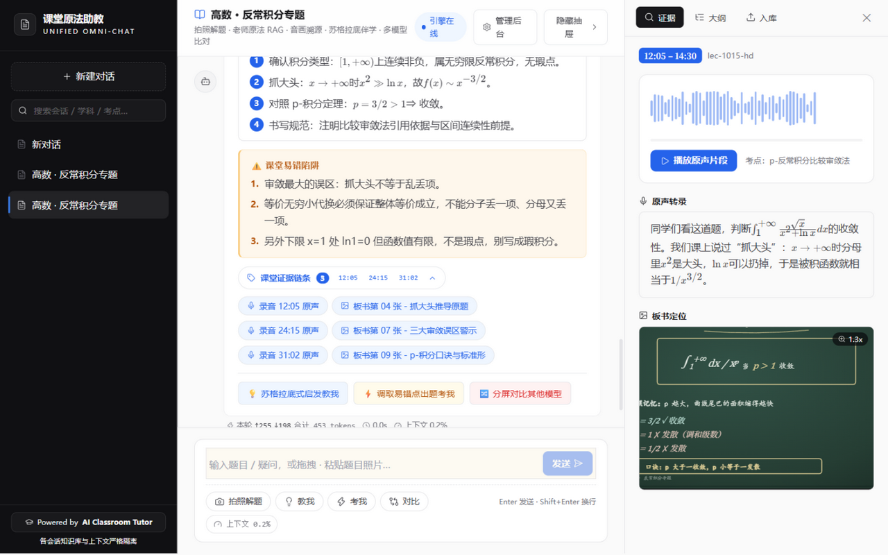
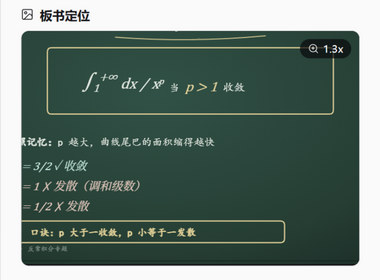
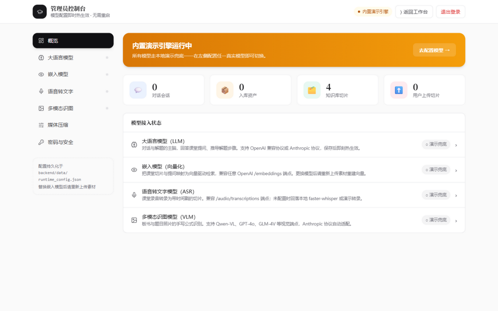
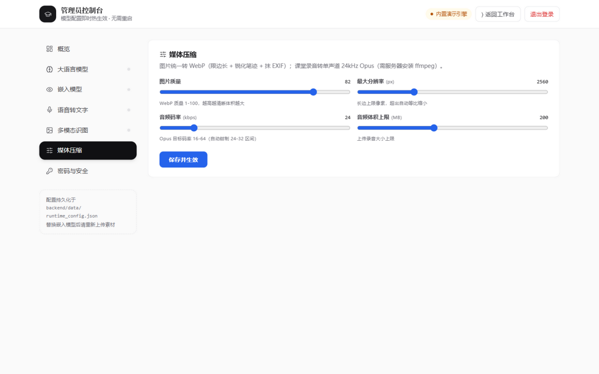

# AI Classroom Tutor · 课堂原法统一工作台

> **⚖️ 双重许可**：开源遵循 **AGPL-3.0**（网络分发/SaaS 必须开源全部代码）；闭源商用、私有化部署、OEM 贴牌需购买**商业授权**（梯度见[文末](#-商业授权与收费梯队)）。联系：**fennengxiong@qq.com**

> ⚠️ **免责声明**：AI 生成的解题步骤与教学内容仅供参考，可能存在错误，使用前请自行核验；详见 [LICENSE](LICENSE) 免责条款。

将 **拍照解题、老师原法 RAG、考点提炼、难度评级、易错预警、音画溯源、苏格拉底伴学、靶向自测、会话隔离、多模型分屏比对与多模态资产入库** 收敛至同一个统一对话工作台（Unified Omni-Chat Workspace）。

## 快速开始

```bash
# 1. 后端（无任何 API Key 也可运行，自动进入内置演示引擎模式）
cd backend
pip install -r requirements.txt
uvicorn app.main:app --port 8000

# 2. 前端
cd frontend
npm install
npm run dev            # http://localhost:3000
```

Docker 一键编排（含 Qdrant/Postgres/Redis/MinIO）：

```bash
cp .env.example .env
docker compose up -d                 # 基础版（backend + frontend + redis）
docker compose --profile full up -d  # 全量版（含向量库/关系库/对象存储）
```

### 🚀 单容器部署

```bash
docker run -d --name studay-rag --restart always   -p 3000:3000 -v studay-data:/app/data   ghcr.io/youshandebo/studay-rag:latest
```

浏览器打开 `http://服务器IP:3000`，**首次访问自动进入初始化向导**：网页里创建
管理员账号（旗舰档 + 同时解锁管理控制台），完成后学生从登录页注册使用。
数据（SQLite + 配置 + 素材）全部落在 `studay-data` 卷，重启/升级不丢。
需要更强检索与多副本时，再用下面的 compose 全栈编排（Postgres/Qdrant/Redis）。

### 🚀 服务器一键部署（镜像由 GitHub Actions 云端构建，服务器免装构建环境）

每次 push 到 `main`，[Docker 工作流](.github/workflows/docker.yml) 自动构建前后端镜像并推送至 GHCR。服务器上：

```bash
# 1. 拉取仓库（或仅复制 docker-compose.prod.yml 与 .env）
git clone https://github.com/youshandebo/studay-RAG.git && cd studay-RAG

# 2. 配置环境（务必改掉 POSTGRES/MINIO 弱口令，设置 ADMIN_PASSWORD 与 ADMIN_JWT_SECRET）
cp .env.example .env && vi .env

# 3. 拉取云端构建好的镜像并启动全栈（backend/frontend/postgres/redis/qdrant/minio）
docker compose -f docker-compose.prod.yml pull
docker compose -f docker-compose.prod.yml up -d

# 升级版本：git pull 后重复 pull + up -d（数据全在具名卷中，不会丢失）
```

- 访问 `http://<服务器IP>:3000`；API 经前端 `/api/proxy` 同源转发，无 CORS 问题
- **端口冲突**：对外端口完全由你定——`.env` 里 `FRONTEND_PORT=任意空闲端口`
  后重启即可（容器内固定 3000，外面随你换）。backend 只绑 127.0.0.1 回环
  不对公网暴露。建议流程：`ss -tlnp | grep -E ':3000|:8080'` 先确认空闲再定；
  要绑域名 + HTTPS 建议前面加一层 Caddy/Nginx，让 80/443 归它管
- 数据持久化：Postgres/Redis/Qdrant/MinIO 各自具名卷；`backend-data` 卷保存
  runtime_config 与 JWT 密钥（勿删，否则已签发登录态失效）
- GHCR 包默认私有：仓库 Settings → Packages 可改 Public，或在服务器
  `docker login ghcr.io` 后再 pull
- `NEXT_PUBLIC_API_BASE` 已在云端构建时固定为 `/api/proxy`，无需配置

## 模型接入

**方式一：管理后台（推荐）** —— 访问 `http://localhost:3000/admin`（或点击工作台右上角 ⚙️ 管理后台），登录后在面板中在线配置以下四类模型，保存即时热生效、无需重启，配置持久化于 `backend/data/runtime_config.json`：

| 配置分区 | 用途 | 协议 |
| --- | --- | --- |
| 大语言模型（LLM） | 对话/解题主脑 | OpenAI 兼容 或 Anthropic |
| 嵌入模型 | 切片与提问向量化检索 | OpenAI 兼容 `/embeddings` |
| 语音转文字模型 | 课堂录音转录 | OpenAI 兼容 `/audio/transcriptions` |
| 多模态识图模型 | 板书/题目照片 OCR | OpenAI 兼容视觉端点 / Anthropic |

- 默认管理员口令 `admin123`（可用环境变量 `ADMIN_PASSWORD` 覆盖），首次登录后请在「管理员密码」分区修改。
- 面板内每类模型均有「测试连通性」按钮；提交掩码 Key = 保持不变，清空 = 回落 `.env` 环境变量默认。
- 替换嵌入模型后，旧向量维度不再匹配，请重新上传素材以重建切片向量。

**方式二：环境变量**（首次部署/容器编排常用）——所有模型调用点均为 Provider 抽象层，配置任一 Key 即自动切换真实 API，未配置时回落本地流式演示引擎：

| 环境变量 | 服务商 |
| --- | --- |
| `OPENAI_API_KEY` | OpenAI 及兼容网关 |
| `ANTHROPIC_API_KEY` | Claude 系列 |
| `DASHSCOPE_API_KEY` | 通义千问（含 Qwen-VL 板书识别） |
| `DEEPSEEK_API_KEY` | DeepSeek |
| `ADMIN_PASSWORD` | 管理员初始口令（默认 admin123） |

## 🖼️ 界面预览

**统一工作台**——左会话栏（搜索/隔离）+ 中全能对话 + 右证据抽屉：



**解题卡与音画证据链**——折叠胶囊时间戳徽章，点开即看波形回放、KaTeX 转录与板书定位：



**板书 Pan & Zoom**——滚轮缩放（右上角实时倍率）、拖拽平移，细小角标看得清：



**管理员控制台**——黑板报登录 + 概览仪表盘（引擎模式/知识库统计/模型接入状态）：

<p align="center">
  
  
</p>

**媒体压缩配置**——图片质量/最大分辨率/音频码率/体积上限，滑杆即调即生效：



---

## 功能矩阵

| 功能 | 触发方式 | 表现 |
| --- | --- | --- |
| 拍照原法解题 | 拖拽/粘贴题目图片 | OCR 提取公式 → 检索课堂切片 → 老师原法推导 + 考点徽章 + 难度星级 |
| 易错预警 | 随解题自动生成 | 推导下方高亮插入琥珀色警示卡 |
| 音画证据溯源 | 点击 🔊/🖼️ 证据标签 | 右侧抽屉滑出：波形播放 + 板书原图 + 原声转录 |
| 苏格拉底伴学 | 「教我 / 没懂」或操作条 | 分步设问状态机 + 渐进提示 + 作答评估 + 掌握度累计 |
| 靶向自测 | 「考我」或操作条 | 调取易错陷阱生成变式题，内嵌选项即时批改与归因 |
| 多模型分屏比对 | 「对比」或操作条 | 原地 2~4 栏并发流式渲染各模型解法 |
| 会话隔离 | 左侧栏切换 | sessionId 严格隔离，IndexedDB 持久化 |
| 多模态入库 | 右抽屉「入库」页签 | 录音/板书/文字粘贴上传 → ASR/VLM/切片 → 洞察提炼 → 向量入库 |
| 管理员后台 | `/admin` 或顶栏 ⚙️ | 四类模型在线配置（热生效）+ 连通性测试 + 口令管理 + 知识库统计 |
| 全局 RAG 问答 | 直接向 AI 提问 | 普通提问自动检索知识库，命中切片注入上下文并挂载证据链 |

## SSE 事件协议

`POST /api/v1/chat/stream`

```
event: meta         { message_id, intent }
event: evidence     { list: EvidenceRef[] }
event: delta        { text }                       # 主叙述流式增量
event: track_delta  { index, model_name, text }    # 多模型分轨增量
event: card         PolymorphicMessage             # 最终多态卡片
event: done         {}
```

## 目录结构

```
backend/   FastAPI + 意图路由 + RAG(向量化/切片/对齐/混合检索) + 苏格拉底/出题/批改 Agent + 入库流水线
frontend/  Next.js 14 + Zustand 四状态机 + Dexie 离线库 + 多态卡片渲染 + KaTeX
docker-compose.yml   一键编排
```

## 兜底策略一览

- 无 LLM Key → 内置课堂剧本演示引擎（流式 token 化输出）
- 无 Qdrant → 进程内余弦向量索引
- 无 Postgres → 内存仓储
- 无 Whisper → 内置带毫秒时间戳的演示转录
- **持久化为真实可选**：`POSTGRES_DSN` 需先 `pip install asyncpg "sqlalchemy[asyncio]>=2.0"`，`QDRANT_URL` 需先 `pip install qdrant-client`；未安装驱动/未配置时自动降级进程内存储（重启即失，部署多副本必须配置）
- 无 MinIO → 本地静态目录托管

---

## 💼 商业授权与收费梯队

AGPL-3.0 义务不适合你的场景？购买商业授权即可豁免开源义务、移除署名并获得长期支持：

| 梯队 | 适用对象 | 包含权益 | 定价 |
| --- | --- | --- | --- |
| **社区版** | 个人学习 / 开源爱好者 | 免费使用全部功能，遵循 AGPL-3.0 义务（保留署名、网络分发开源） | ¥0 |
| **机构单实例版** | 学校 / 培训机构（单校区） | 私有化部署豁免开源 · 去除署名徽标 · 一年更新与工单支持 | ¥3,999 / 实例 / 年 |
| **SaaS 运营版** | 在线教育平台 | 多租户运营豁免 AGPL 网络条款 · 商用级 SLA · 版本随行升级 | ¥19,999 / 年 起 |
| **OEM 贴牌买断版** | 厂商二次分发 | 永久买断 · 品牌完全替换 · 源码级定制排期 · 法务合规包 | 面议 |

📩 **商务合作**：fennengxiong@qq.com（注明场景与规模，工作日 24h 内回复）

## 📄 许可与第三方

- 本项目代码：AGPL-3.0-or-later 或 商业授权（二选一），完整条款见 [LICENSE](LICENSE) 与 [LICENSES/AGPL-3.0.txt](LICENSES/AGPL-3.0.txt)
- 引用的开源模型/组件（Whisper MIT、Qwen Apache-2.0、Qdrant Apache-2.0 等）各自以其随附许可为准，详见 LICENSE 第三方声明
